# Erasmus Thesis — Underwater Pipe Inspection & Detection

End-to-end tooling for **video preprocessing**, **underwater image enhancement**, **semantic segmentation (U-Net)**, and **object detection (YOLOv8 transfer learning)** for pipe inspection workflows.

## Project gallery

| Video splitting | Frame extraction | Interactive image tuning |
|:---:|:---:|:---:|
| 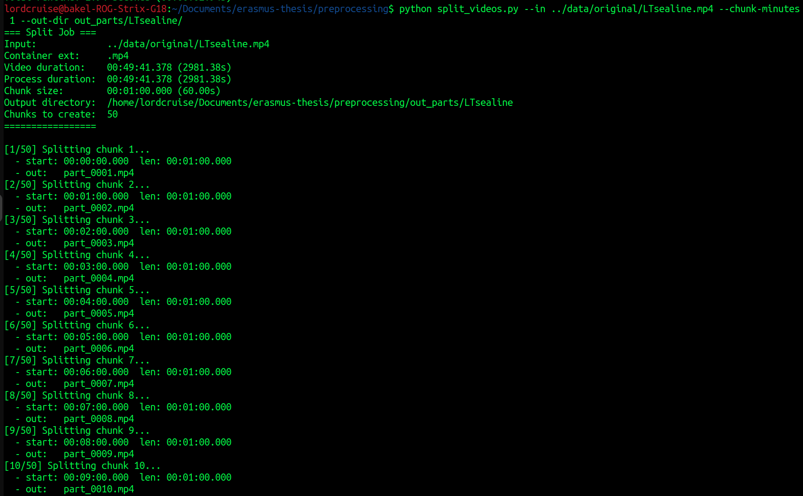 | 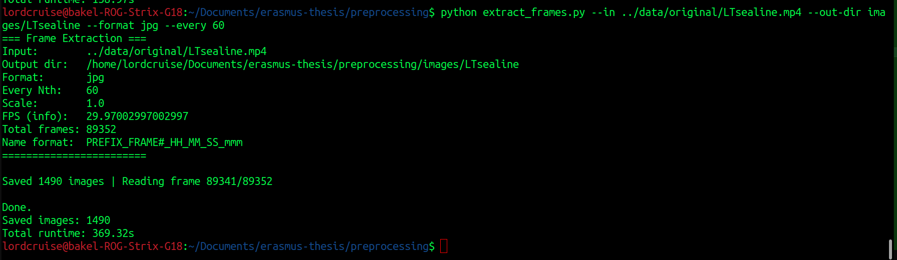 | 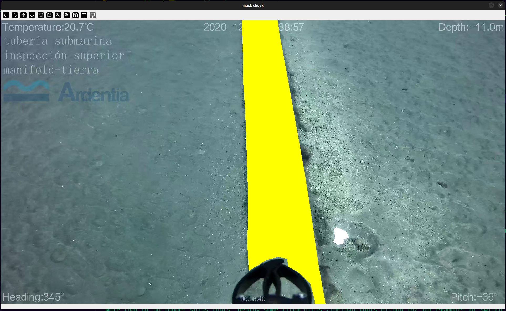 |

<a id="unet-performance-metrics"></a>

## U-Net segmentation — performance metrics (`train/training_results-final/`)

All figures below live in **`train/training_results-final/`** (final training export). The companion files **`training_report.md`** and **`training_history.json`** in the same folder contain the full configuration, per-epoch tables, and raw history.

**Model (from report):** U-Net with **ResNet-34** encoder (ImageNet pretrained), **scSE** decoder attention, input **512×512**, batch size **8**, **100** epochs, Dice loss, augmentations (H/V flip, rotate 90°, shift–scale–rotate, ImageNet normalise), LR **ReduceLROnPlateau** (factor 0.5, patience 5).

### Best epoch (selected by validation IoU): **epoch 77**

| Metric | Train | Val |
|--------|-------|-----|
| Loss | 0.0296 | 0.0371 |
| **IoU** | 0.9512 | **0.9355** |
| **Dice** | 0.9749 | **0.9663** |
| Precision | 0.9723 | 0.9613 |
| Recall | 0.9776 | 0.9715 |
| F1 | 0.9749 | 0.9663 |
| Specificity | 0.9940 | 0.9925 |
| Accuracy | 0.9910 | 0.9891 |

### Final epoch (**100**) — validation snapshot

| Metric | Train | Val |
|--------|-------|-----|
| Loss | 0.0264 | 0.0375 |
| IoU | 0.9561 | 0.9338 |
| Dice | 0.9775 | 0.9653 |
| Precision | 0.9747 | 0.9649 |
| Recall | 0.9804 | 0.9657 |
| F1 | 0.9775 | 0.9653 |

### Exported figures (all metrics in this run)

| 01 — Loss curves | 02 — IoU / Dice curves |
|:---:|:---:|
| 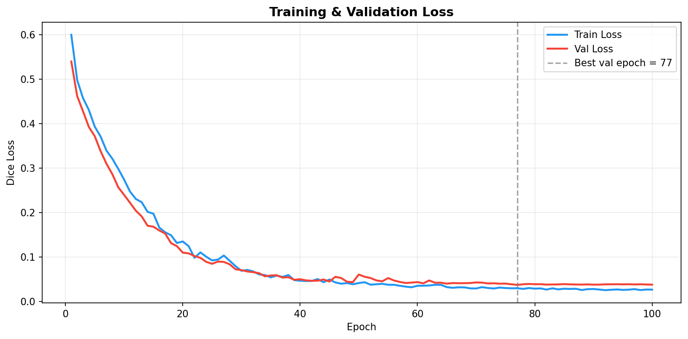 | 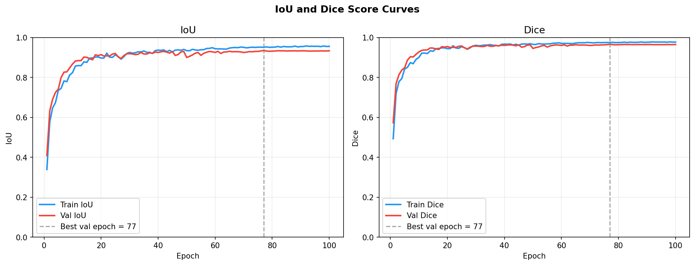 |

| 03 — Learning-rate schedule | 04 — Precision / recall curves |
|:---:|:---:|
| 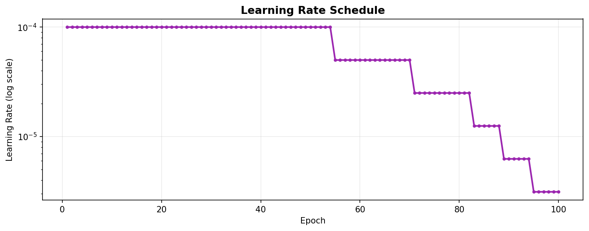 | 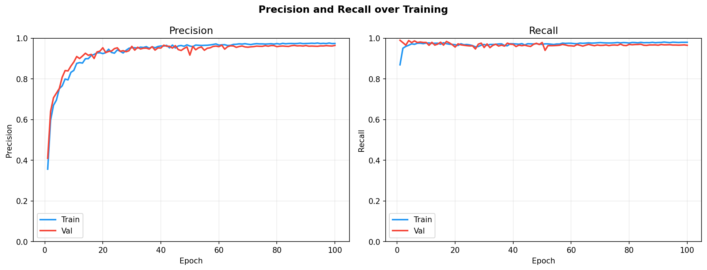 |

| 05 — F1 / Specificity curves | 06 — Metric heatmap |
|:---:|:---:|
| 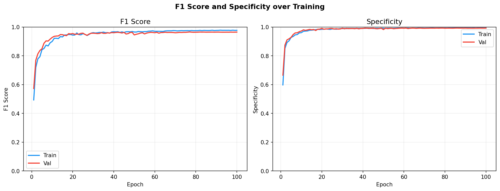 | 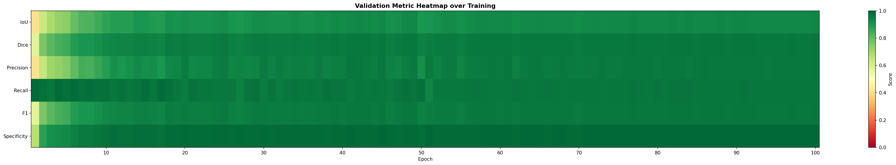 |

| 07 — Confusion matrix (best epoch) | 08 — Gradient norm |
|:---:|:---:|
| 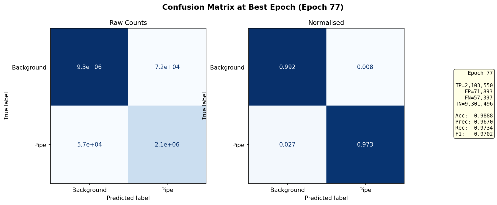 | 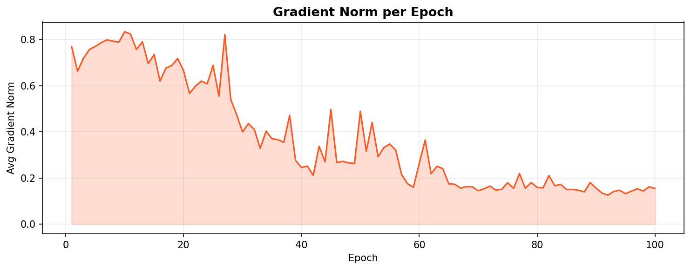 |

| 09 — Train vs validation gap | 10 — Per-epoch summary table |
|:---:|:---:|
| 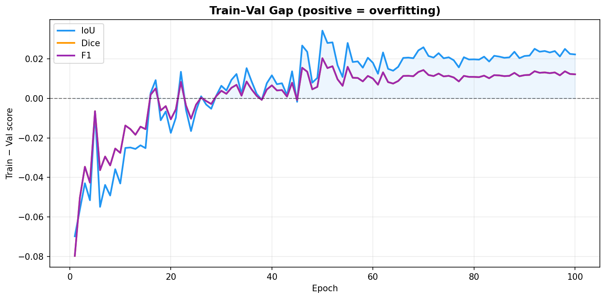 | 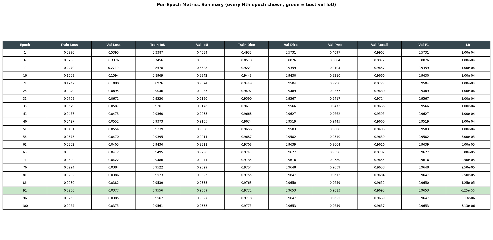 |

---

## YOLOv8 — object detection (separate experiment)

Bounding-box detection uses **`transfer-learning/training-test-run.ipynb`** and Ultralytics; run outputs normally live under **`runs/`** (gitignored). If you keep optional snapshot plots for documentation, they can still live under **`docs/performance/`**. Reported validation metrics from that run (when available): mAP50 ≈ 0.995, mAP50-95 ≈ 0.951, precision ≈ 0.991, recall ≈ 0.992.

## Cloning & setup (GitHub)

```bash
git clone https://github.com/<your-username>/erasmus-thesis.git
cd erasmus-thesis
python -m venv .venv
source .venv/bin/activate   # Windows: .venv\Scripts\activate
pip install -r requirements.txt
```

**Note:** Large paths (`data/`, `runs/`, `train/data/`, etc.) are listed in `.gitignore`. Add your own videos, COCO exports, and Roboflow/YOLO weights locally after clone. **Segmentation metrics and figures** for this README are committed under **`train/training_results-final/`** (see section above). Optional YOLO snapshot images may live under `docs/performance/` if you add them.

**Security:** Do not commit API keys. The transfer-learning notebook expects `ROBOFLOW_API_KEY` as an environment variable (see `transfer-learning/training-test-run.ipynb`). Rotate any key that was ever committed to git history before making the repository public.

## Overview

This repository contains a complete pipeline for underwater pipe detection using deep learning. The codebase includes tools for:

- **Video Preprocessing**: Splitting large video files into smaller chunks and extracting frames for training datasets
- **Image Enhancement**: Interactive tuning pipeline for enhancing underwater images with adjustable parameters
- **Deep Learning**: Transfer learning with YOLOv8 for real-time pipe detection in underwater images and videos
- **Segmentation**: U-Net training on COCO-style masks (`train/train-u-net.ipynb`; see `train/README.md`)

## Requirements

### Dependencies

- **Python 3.7+**
- **OpenCV** (`cv2`) - for video processing and computer vision
- **NumPy** - for numerical operations
- **PyTorch** - for deep learning (with CUDA support recommended)
- **Ultralytics YOLOv8** - for object detection model
- **Roboflow** - for dataset management (optional)
- **FFmpeg** - for video splitting (must be installed on system)

Install Python dependencies:
```bash
pip install opencv-python numpy ultralytics roboflow
```

For GPU acceleration, install PyTorch with CUDA support:
```bash
pip install torch torchvision --index-url https://download.pytorch.org/whl/cu118
```

Install FFmpeg:
- **Ubuntu/Debian**: `sudo apt-get install ffmpeg`
- **macOS**: `brew install ffmpeg`
- **Windows**: Download from [ffmpeg.org](https://ffmpeg.org/download.html)

## Scripts

### 1. `preprocessing/split_videos.py`

Splits a large video file into smaller chunks while preserving the original codec and quality using FFmpeg stream copy (no re-encoding).

#### Usage

```bash
python preprocessing/split_videos.py --in <input_video> --chunk-minutes <minutes> [options]
```

#### Arguments

- `--in` (required): Input video file path
- `--chunk-minutes` (required): Length of each output chunk in minutes (e.g., `1` for 1-minute chunks)
- `--out-dir` (optional): Output directory for split videos (default: `splits`)
- `--total-minutes` (optional): How many minutes from the start to process (default: entire video)
- `--prefix` (optional): Filename prefix for output files (default: `part`)

#### Example

```bash
python preprocessing/split_videos.py \
    --in ../data/original/LTsealine.mp4 \
    --chunk-minutes 1 \
    --out-dir out_parts/LTsealine/
```

This creates 1-minute video chunks named `part_0001.mp4`, `part_0002.mp4`, etc.

#### Notes

- Uses FFmpeg stream copy for fast processing without quality loss
- Output files maintain the same container format as the input
- All chunks are created properly with accurate seeking

---

### 2. `preprocessing/extract_frames.py`

Extracts frames from video files and saves them as individual images. Useful for creating training datasets or analyzing specific frames.

#### Usage

```bash
python preprocessing/extract_frames.py --in <input_video> [options]
```

#### Arguments

- `--in` (required): Input video file path
- `--out-dir` (optional): Output directory for extracted frames (default: `frames`)
- `--format` (optional): Image format - `png` or `jpg` (default: `png`)
- `--prefix` (optional): Filename prefix (default: `frame`)
- `--every` (optional): Save every Nth frame (default: `1` = save all frames)
- `--scale` (optional): Resize factor (e.g., `0.5` for half size, default: `1.0`)
- `--start-ms` (optional): Timestamp offset in milliseconds (default: `0.0`)

#### Example

```bash
python preprocessing/extract_frames.py \
    --in ../data/original/LTsealine.mp4 \
    --out-dir frames/LTsealine \
    --format jpg \
    --every 60 \
    --prefix frame
```

This extracts every 60th frame (approximately 1 frame per 2 seconds for 30 FPS video) and saves them as JPG files.

#### Output Format

Frames are saved with the naming pattern:
```
PREFIX_FRAMENUMBER_HH_MM_SS_mmm.format
```

Example: `frame_000001_00_01_23_456.jpg`

---

### 3. `preprocessing/image-tuning/tuning-pipeline.py`

Interactive image enhancement tool for underwater images. Provides real-time parameter tuning with visual feedback and batch processing capabilities. Uses a multi-stage enhancement pipeline optimized for underwater photography.

#### Usage

**Interactive Tuning Mode** (recommended for first-time use):
```bash
python preprocessing/image-tuning/tuning-pipeline.py --tune-image <image_path>
```

**Batch Processing Mode**:
```bash
python preprocessing/image-tuning/tuning-pipeline.py \
    --in-dir <input_folder> \
    --out-dir <output_folder> \
    --load-params enhance_params.json
```

#### Arguments

- `--tune-image`: Path to a representative image for interactive parameter tuning
- `--in-dir`: Input folder containing images to enhance (for batch processing)
- `--out-dir`: Output folder for enhanced images (required for batch processing)
- `--save-params`: Path to save tuned parameters as JSON (default: `enhance_params.json`)
- `--load-params`: Path to load previously saved parameters JSON
- `--ext`: Output image format - `jpg` or `png` (default: `jpg`)
- `--quality`: JPEG quality 1-100 (default: `95`)

#### Enhancement Pipeline

The tool applies the following processing steps in order:

1. **White Balance (LAB)**: Adjusts color temperature using A/B channel shifting in LAB color space
2. **Red Boost**: Enhances red channel by blending with histogram-equalized red channel
3. **CLAHE**: Contrast Limited Adaptive Histogram Equalization on the L channel
4. **Dehazing**: Dark-channel-inspired dehazing algorithm to reduce underwater haze
5. **Sharpening**: Unsharp mask sharpening for edge enhancement
6. **Gamma Correction**: Adjustable gamma correction for brightness control

#### Interactive Tuning

When using `--tune-image`, the tool opens two windows:
- **Original**: Shows the unprocessed image
- **Enhanced**: Shows the processed image with real-time parameter overlay

**Controls**:
- **Trackbars**: Adjust 9 parameters in real-time:
  - A Shift: Color temperature adjustment (-50 to +50)
  - B Shift: Color temperature adjustment (-50 to +50)
  - Omega: Dehazing strength (0.0 to 1.0)
  - CLAHE Clip: Contrast limit (0.0 to 5.0)
  - Red Boost: Red channel enhancement (0.0 to 1.0)
  - t_min: Minimum transmission threshold (0.01 to 1.0)
  - Dark r: Dark channel radius (1 to 25)
  - Gamma: Brightness adjustment (0.1 to 3.0)

- **Keyboard Shortcuts**:
  - `s`: Save current parameters to JSON file
  - `q`: Quit tuning interface

**Parameter Overlay**: Current parameter values are displayed as white text with black outline in the top-left corner of the enhanced image for easy visibility.

#### Example Workflow

1. **Tune parameters on a sample image**:
   ```bash
   python preprocessing/image-tuning/tuning-pipeline.py \
       --tune-image frames/LTsealine/frame_000001_00_01_23_456.jpg \
       --save-params my_params.json
   ```

2. **Apply tuned parameters to entire folder**:
   ```bash
   python preprocessing/image-tuning/tuning-pipeline.py \
       --in-dir frames/LTsealine \
       --out-dir frames/LTsealine_enhanced \
       --load-params my_params.json \
       --ext jpg \
       --quality 95
   ```

#### Notes

- Interactive mode requires a display (X11/Wayland on Linux)
- Parameters are saved as JSON and can be reused for batch processing
- Supports common image formats: JPG, PNG, BMP, TIFF, WEBP
- Batch processing preserves directory structure
- Processing speed: ~10-50 images/second depending on image size and hardware

---

### 4. `transfer-learning/training-test-run.ipynb`

Jupyter notebook for training a YOLOv8 model using transfer learning to detect underwater pipes. Uses a pre-trained YOLOv8 model (YOLOv8s) and fine-tunes it on a custom underwater pipe detection dataset.

#### Overview

This notebook implements transfer learning for object detection:
- **Base Model**: YOLOv8s (pre-trained on COCO dataset)
- **Task**: Fine-tuning for underwater pipe detection
- **Dataset Format**: YOLOv8 format (images + bounding box annotations)
- **Training**: 50 epochs with data augmentation

#### Key Features

- Transfer learning from pre-trained YOLOv8s weights
- Automatic dataset download from Roboflow (set `ROBOFLOW_API_KEY`; see `.env.example`)
- Model training with validation
- Performance evaluation (mAP, precision, recall)
- Inference on test images

#### Usage

Open the notebook in Jupyter or Google Colab:

```bash
jupyter notebook transfer-learning/training-test-run.ipynb
```

Or use Google Colab:
```python
# The notebook includes a Colab badge for easy access
```

#### Training Process

1. **Dataset Setup**: Downloads underwater pipe dataset from Roboflow
2. **Model Initialization**: Loads pre-trained YOLOv8s weights
3. **Training**: Fine-tunes for 50 epochs with:
   - Image size: 640x640
   - Batch size: 16
   - Data augmentation enabled
4. **Validation**: Evaluates on validation set
5. **Testing**: Runs inference on test images

#### Model Performance

The fine-tuned model achieves excellent results:
- **mAP50**: 0.995 (99.5%)
- **mAP50-95**: 0.951 (95.1%)
- **Precision**: 0.991 (99.1%)
- **Recall**: 0.992 (99.2%)

#### Dataset Structure

The dataset follows YOLOv8 format:
```
datasets/
└── underwater-pipes-1/
    ├── train/
    │   ├── images/
    │   └── labels/
    ├── valid/
    │   ├── images/
    │   └── labels/
    ├── test/
    │   ├── images/
    │   └── labels/
    └── data.yaml
```

#### Notes

- Requires GPU for efficient training (NVIDIA GPU with CUDA recommended)
- Training time: ~2 hours on RTX 5080 GPU for 50 epochs
- Model weights are saved in `runs/detect/train2/weights/best.pt`
- Can be adapted for other object detection tasks

---

## My Use Case

### Video Processing Workflow

For processing large video files for machine learning training:

#### Step 1: Split Video into Manageable Chunks


Split the large video file into smaller 1-minute segments:

```bash
python preprocessing/split_videos.py \
    --in ../data/original/LTsealine.mp4 \
    --chunk-minutes 1 \
    --out-dir out_parts/LTsealine/
```

This creates multiple smaller video files that are easier to process and manage.


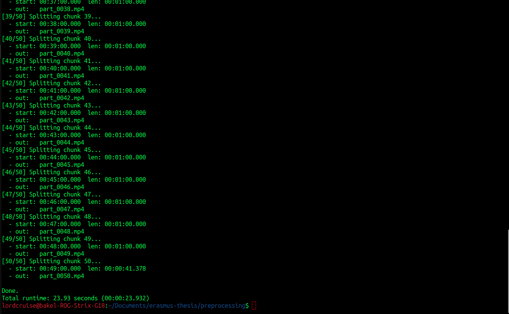

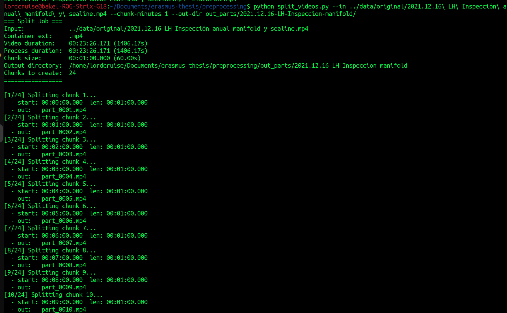


#### Step 2: Extract Frames for Training Data

Extract frames from the videos with a sampling period of 2 seconds (taking 1 frame every 60 frames for 30 FPS video):

```bash
python preprocessing/extract_frames.py \
    --in <video_file> \
    --out-dir frames/LTsealine \
    --format jpg \
    --every 60 \
    --prefix frame
```

**Calculation**: For a 30 FPS video:
- 1 frame every 60 frames = 1 frame every 2 seconds
- This provides a good sampling rate for training datasets while keeping file sizes manageable


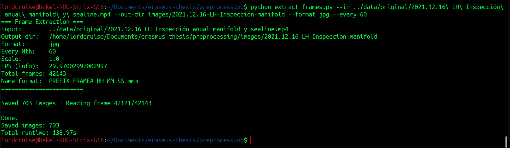

#### Step 3: Enhance Images (Optional)

Before training, you may want to enhance the extracted frames to improve image quality and potentially improve model performance:

1. **Tune enhancement parameters** on a representative image:
   ```bash
   python preprocessing/image-tuning/tuning-pipeline.py \
       --tune-image frames/LTsealine/frame_000001_00_01_23_456.jpg \
       --save-params enhance_params.json
   ```
   - Adjust sliders until the image looks good
   - Press `s` to save parameters
   - Press `q` to quit

2. **Apply enhancement to all frames**:
   ```bash
   python preprocessing/image-tuning/tuning-pipeline.py \
       --in-dir frames/LTsealine \
       --out-dir frames/LTsealine_enhanced \
       --load-params enhance_params.json \
       --ext jpg
   ```

The enhancement pipeline includes:
- White balance correction for underwater color casts
- CLAHE for better contrast
- Dehazing to reduce underwater haze
- Sharpening for clearer edges
- Gamma correction for optimal brightness

#### Step 4: Train Deep Learning Model with Transfer Learning

After extracting frames and preparing the dataset, train a YOLOv8 model using transfer learning for pipe detection:

1. **Prepare Dataset**: Organize extracted frames into train/valid/test splits with YOLOv8 format annotations
   - Label images with bounding boxes around pipes
   - Use tools like Roboflow or LabelImg for annotation

2. **Train Model**: Open the transfer learning notebook:
   ```bash
   jupyter notebook transfer-learning/training-test-run.ipynb
   ```

3. **Training Configuration**:
   - Base model: YOLOv8s (pre-trained on COCO)
   - Epochs: 50
   - Image size: 640x640
   - Batch size: 16

4. **Results**: The trained model achieves (validation, typical Ultralytics run): mAP50 ≈ 99.5%, mAP50-95 ≈ 95.1%, precision ≈ 99.1%, recall ≈ 99.2%. Optional Ultralytics plots can be placed under `docs/performance/` for documentation.

5. **Use Trained Model**: The best model weights are saved at:
   ```
   runs/detect/train2/weights/best.pt
   ```

This model can then be used for real-time pipe detection in new underwater videos and images.

#### Step 5: U-Net pipe segmentation (metrics in repo)

For **semantic segmentation** (pixel masks), use `train/train-u-net.ipynb` and see **`train/README.md`**. Final curves, confusion matrix, and tables are published under **`train/training_results-final/`** — the same figures as in the [U-Net performance section](#unet-performance-metrics) at the top of this README.

---

## Project Structure

```
erasmus-thesis/
├── data/
│   ├── original/          # Original video files
│   ├── shorts/            # Short video clips
│   └── images/            # Extracted frame images
├── preprocessing/
│   ├── split_videos.py    # Video splitting script
│   ├── extract_frames.py  # Frame extraction script
│   ├── image-tuning/
│   │   └── tuning-pipeline.py  # Interactive image enhancement tool
│   └── short_videos/      # Output directory for split videos
├── docs/                  # Screenshots; optional `docs/performance/` for YOLO snapshots
├── transfer-learning/
│   └── training-test-run.ipynb  # YOLOv8 transfer learning notebook
├── train/
│   ├── train-u-net.ipynb  # U-Net semantic segmentation (COCO masks)
│   ├── training_results-final/  # Final run: plots 01–10, training_report.md, training_history.json
│   └── README.md          # Training documentation
├── ref/                   # (gitignored by default — optional local reference clone)
├── runs/                  # (gitignored — regenerate with notebooks)
└── README.md              # This file
```

---

## Technical Notes

### Video Splitting (`split_videos.py`)

- Uses FFmpeg with `-ss` after `-i` for accurate seeking
- Stream copy mode (`-c copy`) preserves original quality without re-encoding
- Handles timestamp issues with `-avoid_negative_ts make_zero`
- All chunks are created properly, even when starting from non-keyframe positions

### Frame Extraction (`extract_frames.py`)

- Uses OpenCV for video reading and frame extraction
- Timestamps are calculated from video decode position
- Supports resizing for memory efficiency
- Handles videos with unknown frame counts gracefully

### Image Enhancement (`tuning-pipeline.py`)

- **Multi-stage Pipeline**: Applies 6 enhancement stages in optimal order for underwater images
- **Interactive Tuning**: Real-time parameter adjustment with visual feedback
- **Parameter Management**: Save/load enhancement parameters as JSON for reproducibility
- **Batch Processing**: Efficiently processes entire folders while preserving directory structure
- **Enhancement Techniques**:
  - LAB color space white balance for accurate color correction
  - Histogram-based red channel boosting
  - CLAHE for adaptive contrast enhancement
  - Dark-channel dehazing algorithm for haze reduction
  - Unsharp masking for edge sharpening
  - Gamma correction for brightness control
- **User Interface**: Parameter overlay with white text on dark background for maximum visibility

### U-Net segmentation (`train/training_results-final/`)

- **Architecture**: U-Net with ResNet-34 encoder (ImageNet pretrained) and scSE decoder attention (see `train/training_results-final/training_report.md`)
- **Training**: 100 epochs, 512×512 input, Dice loss, strong augmentations; best validation IoU at epoch **77** (**0.9355** val IoU, **0.9663** val Dice)
- **Artifacts**: Numbered plots `01_`…`10_`, confusion matrix at best epoch, gradient norms, train/val gap, per-epoch summary table image

### Deep learning & transfer learning — YOLO (`training-test-run.ipynb`)

- **Transfer learning**: Fine-tunes pre-trained YOLOv8s on a custom underwater pipe detection dataset
- **Performance** (typical validation run): mAP50 ≈ 0.995, mAP50-95 ≈ 0.951, precision ≈ 0.991, recall ≈ 0.992
- **Inference**: Real-time capable on GPU (order of a few ms per image in validation logs)

Additional informal screenshots remain in `docs/` (filenames with spaces); the tables above use stable paths for the README on GitHub.

## License

This code is part of an Erasmus thesis project.
